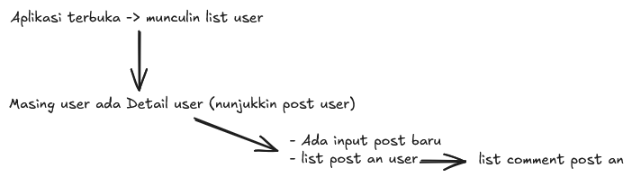

## Alur Aplikasi Sederhana:

Menggunakan API JSONPlaceholder

alur aplikasi yang diinginkan:


Bedah baris kode!

1. Pertama, buat struktur simpel di html javascript
   di html buat seperti ini

```html
<ul id="list-user"></ul>

<script src="script.js"></script>
```

lalu setelah itu di javascript buat seperti ini:

```js
// guna nya untuk menghubungkan elemen di html dengan javascript nya
const listUser = document.getElementById("list-user");
```

2. Buat fungsi utama, untuk fetch user via API
   buat function `dataUser()` untuk fetch API user

```js
async function dataUser() {
  console.log("Mulai request...");

  try {
    const resUser = await fetch("https://jsonplaceholder.typicode.com/users");
    if (!resUser.ok) {
      throw new Error(`http error! status code ${resUser.status}`);
    }

    const dataUser = await resUser.json();
    console.log(dataUser);

    // ini nanti ada di tahapan ketiga, buat function untuk menampilkan data nya ke HTML
    tampilkanData(dataUser);
  } catch (err) {
    console.log(err.message);
  } finally {
    console.log("Request selesai!");
  }
}
```

Penjelasannya:

- `async/await`: menunggu data HTTP GET Request tanpa memberhentikan browser (bergerak dibelakang)
- `fetch(...)`: meminta data user via API
- `if(!resUser.ok)`: mengecek jika status HTTP bukan 200 - 299 (misal: 404 / 500)
- `resUser.json()`: mengubah data respon JSON menjadi Array object javascript
- `tampilkanData(dataUser)`: melempar data array ke fungsi render HTML

3. Buat fungsi untuk menampilkan data ke HTML
   fungsi ini menerima parameter array

```js
function tampilkanData(arrData) {
  listUser.textContent = "";

  arrData.forEach((user) => {
    const li = document.createElement("li");

    li.innerHTML = `
            <p>Name: ${user.name}</p>
            <p>Usn: ${user.username}</p>
            <p>Email: ${user.email}</p>
            <p>Address: ${user.address.city}, ${user.address.suite}, ${user.address.street}</p>
            <p>Phone: ${user.phone}</p> 
            <button class="btn-detail" data-id="${user.id}">Lihat Detail</button>

            <!-- sebagai wadah post masing user  -->
            <div class="post-container"></div>
        `;

    const btnDetail = li.querySelector(".btn-detail");
    const postContainer = li.querySelector(".post-container");

    // event click untuk toggle detail
    btnDetail.addEventListener("click", async () => {
      // jika post-container sudah ada isinya/ lagi terbuka
      if (postContainer.innerHTML !== "") {
        postContainer.innerHTML = ""; // kosongkan/sembunyikan
        btnDetail.textContent = "Lihat Detail";
      } else {
        // lagi tertutup / tidak ada isi di dalam post-container
        btnDetail.textContent = "Loading Post...";
        await postUser(user.id, postContainer);
        btnDetail.textContent = "Tututp Detail";
      }
    });

    listUser.append(li);
  });
}
```

Penjelasan:

- `listUser.textContext = ""`: berguna untuk mengosongkan data, agar jika ada data baru tidak terjadi duplikasi
- `arrData.forEach((user) => ...)`: untuk melakukan pengulangan tiap tiap data user yang ada
- `<div class="post-container"></div>`: didalam `li.innerHTML` kode ini berfungsi sebagai penampung dari data Posts user nanti
- `btnDetail.addEventListener("click", ...)`:
  - Teks pada tombol selalu menunjukkan AKSI SANG PENGGUNA SELANJUTNYA, bukan kondisi saat ini.
  - Saat layar TERTUTUP -> Tombol tulisannya "Lihat Detail" (Menunggu diklik untuk Buka).
  - Saat layar TERBUKA -> Tombol tulisannya "Tutup Detail" (Menunggu diklik untuk Tutup).
- `await postUser(user.id, postContainer);`: kode ini untuk memanggil data post dengan id user yang sesuai, lalu postContainer ini sebagai template HTML post nya

4. Buat fungsi untuk mengambil data Post user

```js
// function untuk mengambil data data post dari masing masing user
async function postUser(userId, container) {
  try {
    const resPost = await fetch(
      `https://jsonplaceholder.typicode.com/posts?userId=${userId}`,
    );
    if (!resPost.ok) throw new Error(`gagal memuat Post`);
    const dataPosts = await resPost.json();

    const ulPost = document.createElement("ul");

    dataPosts.forEach((posts) => {
      const liPost = document.createElement("li");

      liPost.innerHTML = `
        <h4>Title: ${posts.title}</h4>
        <p>Body: ${posts.body}</p>
        <button class="btn-comment">Lihat komentar</button>

        <div class="comment-container"></div>
      `;

      const btnComment = liPost.querySelector(".btn-comment");
      const commentContainer = liPost.querySelector(".comment-container");

      btnComment.addEventListener("click", async () => {
        if (commentContainer.innerHTML !== "") {
          commentContainer.innerHTML = "";
          btnComment.textContent = "Lihat komentar";
        } else {
          btnComment.textContent = "Loading...";
          await commentPostUser(posts.id, commentContainer);
          btnComment.textContent = "Tutup komentar";
        }
      });

      ulPost.append(liPost);
    });

    container.append(ulPost);
  } catch (err) {
    container.innerHTML = `${err.message}`;
  }
}
```

Penjelasan:

- `fetch(
  `https://jsonplaceholder.typicode.com/posts?userId=${userId}`,)`: untuk mengambil data post berdasarkan id user yang dikirim
- `container.append(ulPost);`: untuk mengirimkan data HTML yang sudah terisi ke parameter container yang di step sebelum nya berisi template untuk data post
